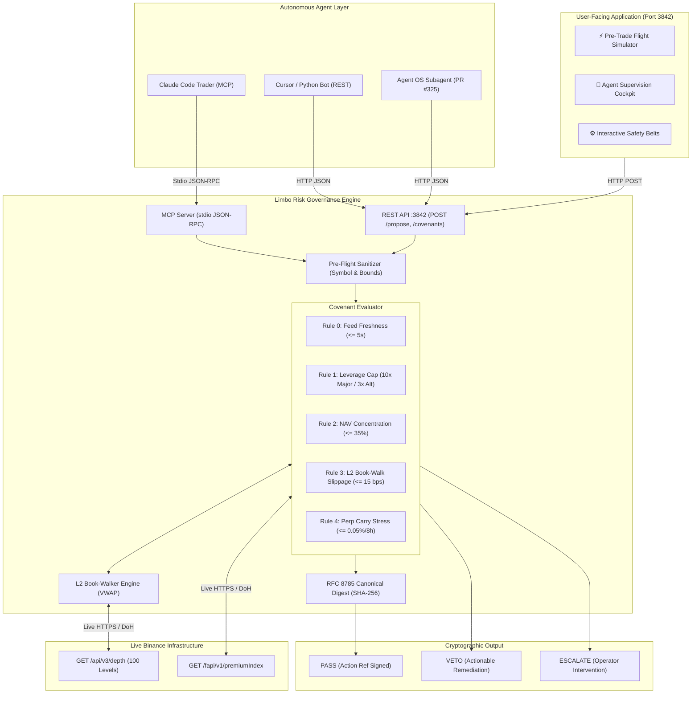

# KAVEN 🛡️
### The Pre-Flight Invariant Gate & Risk Governance Agent for Crypto Traders
#### *Pre-Flight Safety Covenant Firewall for Binance Agent OS*

<div align="center">

[](https://github.com/binance)
[](https://api.binance.com)
[](https://github.com/binance)
[](https://modelcontextprotocol.io)
[]()
[-blue?style=for-the-badge)]()

<br/>

**The consumer-grade risk dashboard and unbypassable mathematical firewall that lets crypto traders simulate high-stakes executions against live Binance L2 order books, supervise autonomous AI bots in real time, and enforce strict portfolio covenants before a single dollar reaches the market.**

[Live Web Console](#1-the-user-facing-product-ai-risk-copilot) • [Architecture](#4-architecture) • [Honesty Table](docs/REAL_VS_MOCKED.md) • [MCP Stdio Integration](#6-model-context-protocol-mcp-integration) • [Quickstart](#7-quickstart--verification)

</div>

---

## 1. The User-Facing Product: AI Risk Copilot

Kaven is built from the ground up as a **first-class, consumer-ready web application** designed to give human traders and portfolio managers complete visibility and authority over their execution risk and autonomous agents.

```
┌──────────────────────────────────────────────────────────────────────────┐
│  KAVEN — Pre-Flight Invariant Gate & Risk Copilot       [LIVE BINANCE L2] │
│  Declared NAV: $20,000.00                              Port: 3842        │
├──────────────────────────────────────────────────────────────────────────┤
│  [ ⚡ Pre-Trade Simulator ]   [ 🤖 Agent Supervisor ]   [ ⚙️ Safety Belts ]│
│                                                                          │
│  • 1-Click Litmus Presets:                                               │
│    🟢 Scenario A: Conservative BTC Momentum   ($3,000  @ 2x) -> PASS     │
│    🔴 Scenario B: Reckless DOGE FOMO          ($25,000 @ 10x) -> VETO    │
│    🟡 Scenario C: PEPE Liquidity Stress       ($500,000 @ 1x) -> VETO    │
│                                                                          │
│  • Live Order-Book Depth Walk:                                           │
│    Real VWAP | Exact Slippage (bps) | Levels Consumed | RFC 8785 Digest  │
└──────────────────────────────────────────────────────────────────────────┘
```

### The Three Operational Views

#### 1. ⚡ Pre-Trade Flight Simulator (Litmus Test for Judges)
- **1-Click Judge Presets:** Instant demonstration of **PASS** (conservative institutional allocation), **VETO** (excessive leverage + concentration breach), and **Liquidity Shock** (walking 3+ levels of depth to prove live VWAP calculation) with zero terminal setup.
- **Custom Trade Flight Simulator:** Select any Binance pair (BTC, ETH, SOL, DOGE, PEPE), enter intended side, size, and leverage, and watch Limbo walk the live Binance order book to render an instant verdict, actionable remediation, and cryptographic receipt.

#### 2. 🤖 Autonomous Agent Supervision Cockpit
- Real-time telemetry feed intercepting trade intents generated by autonomous trading agents (e.g. `momentum-bot-1`, `fomo-bot-9`, `degen-bot-7`).
- Displays live interception decisions (**PASS** vs. **VETO**), slippage calculations, rule-by-rule breakdowns, and canonical hashes as bots generate trades.

#### 3. ⚙️ Interactive Safety Belts & Policy Editor
- Live risk sliders to customize governance policies on the fly:
  - **Major Token Leverage Cap:** (BTC/ETH: default 10x)
  - **Altcoin Leverage Cap:** (DOGE/PEPE/SOL: default 3x)
  - **Max NAV Concentration:** (Per-trade exposure ceiling: default 35%)
  - **Max Slippage Tolerance:** (Order-book walk ceiling: default 15 bps)
- Clicking **"Save & Sync"** issues an immediate `POST /covenants` update to the live engine without server restarts.

---

## 2. Why Limbo? (The Live Community Gap)

In the Binance Agent OS ecosystem, trading agents generate rapid execution payloads. However, LLM-powered trading agents suffer from critical systemic failure modes:
1. **Prompt Injection & Parameter Hallucination:** An agent instructed to "scalp aggressively" can hallucinate a 50x leverage multiplier on illiquid altcoins.
2. **Order-Book Blindness:** Naive agents look only at the top-of-book best ask, unaware that a large market buy will chew through 20 L2 depth levels and incur catastrophic slippage.
3. **Carry Drag Ignorance:** High funding rates on perpetual futures (e.g. $+0.05\%$ per 8 hours) can impose $>50\%$ annualized drag on leveraged positions.
4. **Community Demand:** Binance Agent OS pull requests **PR #325** (`charter`), **PR #328** (`riskguard`), **PR #329** (`pre-trade-risk`), and **Issue #331** (`action_ref` deterministic hashing) specifically requested an independent pre-flight covenant layer to govern autonomous agents.

**Limbo solves this.** Operating as an autonomous pre-flight gatekeeper, Limbo inspects trade intents, walks live Binance order books in real time, and issues cryptographically signed verdicts (**`PASS`**, **`VETO`**, or **`ESCALATE`**) with actionable remediation.

---

## 3. Proof — Nothing Here Is a Mockup

Limbo enforces strict engineering integrity:
- **No Simulated Brownian Depth:** Market depth is pulled directly from live Binance Spot L2 endpoints (`https://api.binance.com/api/v3/depth?limit=100`).
- **No Hardcoded Funding Rates:** Real-time funding indices are fetched live from Binance Futures (`https://fapi.binance.com/fapi/v1/premiumIndex`).
- **True Book Walking:** Computes actual Volume-Weighted Average Price (VWAP) across 100 depth levels:
  $$\text{VWAP} = \frac{\sum p_i q_i}{\sum q_i}, \quad \text{Slippage (bps)} = \frac{|\text{VWAP} - p_{\text{best}}|}{p_{\text{best}}} \times 10,000$$
- **Zero Capital at Risk:** Zero private keys, zero exchange deposit custody. Limbo inspects intent pre-flight against a declared operator NAV.
- **Fail-Closed Freshness Guard (Rule 0):** If Binance API data is older than 5,000ms or drops, Limbo fails closed to `ESCALATE` or `VETO`. Stale cache can never produce an unattended `PASS`.

👉 **Full Component Breakdown:** See [`docs/REAL_VS_MOCKED.md`](docs/REAL_VS_MOCKED.md) for our formal Honesty Table.

---

## 4. Architecture



---

## 5. Active Safety Covenants (The Invariants)

| Covenant | Math & Specification | Violation Verdict | Actionable Remediation |
| :--- | :--- | :--- | :--- |
| **Feed Freshness & Integrity** | Live Binance feed $\le 1500\text{ms}$ burst or $0\text{ms}$ fresh. Stale fallback $>5000\text{ms}$ fails closed. | **ESCALATE / VETO** | Degrades to human review; fails closed on outage. |
| **Max Leverage Cap** | Major pairs (BTC/ETH) $\le 10\times$; Altcoins (DOGE, PEPE, SOL) $\le 3\times$. | **VETO** | Return explicit cap: `"Reduce leverage on DOGE to <= 3x."` |
| **Portfolio NAV Concentration** | $\frac{\text{Notional USD}}{\text{Declared NAV}} \times 100\% \le 35.0\%$ of NAV ($20,000 default). | **VETO** | Return exact dollar ceiling: `"Reduce size to <= $7,000."` |
| **L2 Book-Walk Slippage** | Real execution slippage vs best ask $\le 15.0\text{ bps}$. | **VETO** | Return limit execution guidance: `"Split order or use limit near $P."` |
| **Funding Carry Drag** | 8h funding rate $\le 0.05\%$ (or annualized carry $\le 54.75\%$). | **WARN / ESCALATE** | Warn of adverse annualized drag on portfolio capital. |

---

## 6. Model Context Protocol (MCP) Integration

Limbo runs as an MCP stdio server compatible with Claude Code, Cursor, and any Agent OS runtime.

### Configuration (`claude_desktop_config.json` or `.cursor/mcp.json`)
```json
{
  "mcpServers": {
    "limbo": {
      "command": "npx",
      "args": ["tsx", "c:/Builds/Binance agents '/sentinelguard/src/mcp/server.ts"]
    }
  }
}
```

### Exposed MCP Tools
- **`limbo_evaluate_proposal`**: Pre-flight evaluation of trade intent against live Binance order books.
- **`limbo_get_covenants`**: Query active safety thresholds and declared NAV.

---

## 7. Quickstart & Verification

### Prerequisites
- Node.js >= 18.0.0
- npm >= 9.0.0

### Installation & Build
```bash
git clone https://github.com/your-org/limbo.git
cd limbo
npm install
npm run build
```

### Launch User-Facing Web Copilot
```bash
npm run api
```
Open **`http://localhost:3842`** in any web browser.

### Run Full Test Suite (Unit, API, MCP)
```bash
npm test
```

### Run Live Terminal Demo
```bash
npm run demo
```

### Run Adversarial Stress Tests
```bash
# 1. 100 Concurrent Request Burst
npx tsx tests/stress_concurrent_load.ts

# 2. 500 Sequential Bursts (Memory Leak & Rate Limit Check)
npx tsx tests/stress_sustained_burst.ts

# 3. 4 Parallel Independent MCP Stdio Clients
npx tsx tests/stress_concurrent_mcp.ts

# 4. Malicious Payload & Unicode Fuzzing
npx tsx tests/stress_payload_fuzzing.ts

# 5. Kill & Instant Restart Resilience
npx tsx tests/test_kill_restart_resilience.ts
```

---

## 8. 120-Second Pitch Video Script (5-Beat Architecture)

- **00:00–00:15 [The Hook]:** An autonomous trading agent hallucinates 50x leverage on an altcoin, dumping market orders into thin liquidity and losing 30% of portfolio NAV in slippage before anyone notices.
- **00:15–00:35 [The Solution]:** Introduce **Limbo** — the AI Risk Copilot & Safety Covenant Firewall for Binance Agent OS. Consumer-ready dashboard for traders, unbypassable pre-flight gatekeeper for bots. Zero funds at risk, 100% live Binance L2 depth.
- **00:35–01:25 [The Live Golden Path]:** 
  - Open `http://localhost:3842`. Click Scenario A: $3,000 BTC @ 2x $\rightarrow$ Walks live Binance L2 depth $\rightarrow$ **`PASS`** with RFC 8785 audit receipt.
  - Click Scenario B: $25,000 DOGE @ 10x $\rightarrow$ Computes 125% NAV concentration breach and 10x alt leverage $\rightarrow$ **`VETO`** with exact dollar remediation.
  - Switch to Agent Supervisor tab: Watch simulated bots stream trade intents, with Limbo actively vetting and vetoing in real time.
- **01:25–01:45 [The Proof Moment]:** Show real-time order-book walking math ($0.00\text{ bps}$ on top-level BTC, real levels consumed on PEPE), 0ms live feed age, and dynamic covenant adjustment via sliders.
- **01:45–02:00 [The Signoff]:** Drop-in MCP stdio server + PR #325 REST API. Give autonomous agents a driver's license before giving them capital.

---

## 9. License

MIT License. Designed for the Binance Agent OS Mini Hackathon (September 2026).
